<h3><code>itsmayankmis@github ~ $ ./contributions.sh</code></h3>

  

<h3><code>itsmayankmis@github ~ $ whoami</code></h3>
<table>
  <tr>
    <td valign="top"></td>
    <td valign="top"></td>
  </tr>
</table>
 

<h3><code>itsmayankmis@github ~ $ ./links.sh</code></h3>
<b>Mayank Mishra</b> 
Mechanical Engineering Student · CAD/CAE · 3D Modelling · Mechanical Design  

<!-- itsmayankmis terminal profile -->

